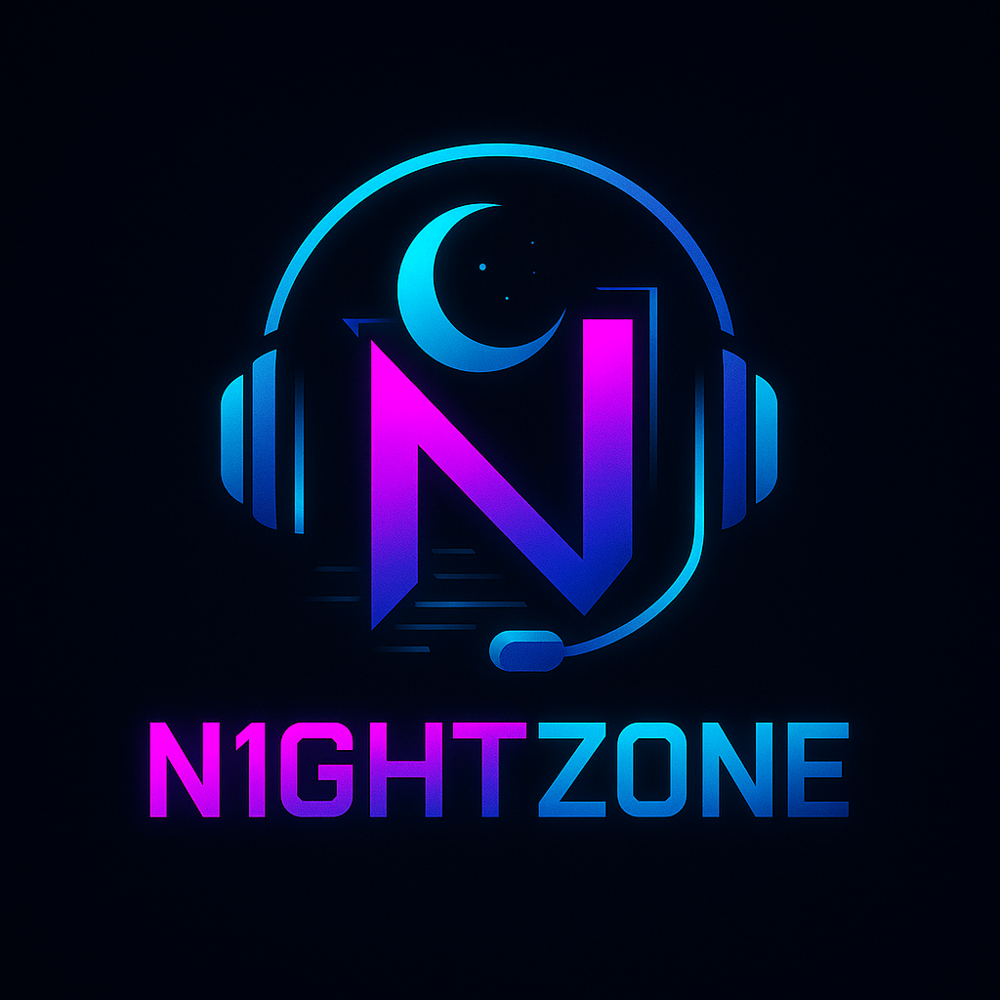

# N1GHTZONE — сеть компьютерных клубов нового поколения

## 🌌 О проекте
**N1GHTZONE** — это не просто компьютерный клуб. Это территория киберспорта, комфорта и геймерской культуры. Высокотехнологичное оборудование, продуманные залы разных форматов и уникальная атмосфера делают нас местом, куда хочется возвращаться.

## 🔗 Ссылка на лендинг
👉 [n1ghtzone.github.io](https://n1ghtzone.github.io)

## 🚀 Формат клубов
- VIP-залы для команд и стримеров
- Стандартные места с премиум-периферией
- Зал для новичков (Lite)
- Собственная кухня и напитки
- Частые турниры и активности

## 🛠️ Технологии
- HTML5 + Tailwind CSS
- JavaScript (если будет функционал)
- GitHub Pages для хостинга

## 💡 О проекте
Проект запущен в рамках подготовки к открытию первого клуба в Новосибирске до конца 2025 года. Цель — выстроить узнаваемый бренд, объединить комьюнити и масштабироваться по городам РФ.

## 📩 Контакты
По вопросам инвестиций и сотрудничества:  
📧 nightzone.business@yandex.ru  
📍 Новосибирск
